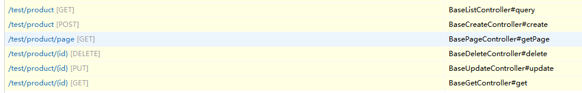

# 接口API

## nuzar-web-starter

添加 `ProductController.java`

```java
@RestController
@LogRecord(module = "test:product")
@PreAuth(prefix = "test:product")
@RequestMapping("/test/product")
public class ProductController extends CommonController<Product, ProductService, ProductController.ProductQuery> {

    /**
     * 快速检索类
     */
    public static class ProductQuery extends QueryModel {
        @QueryParam(filterType = QueryParam.FilterType.LIKE)
        private String brand;
    }
}
```

## 接口规范

关于接口返回类型大体分为三种`String`、`MassResult`、`<T>`自定义类型

如果使用String类型返回，默认会走mvc模式，如果需要返回json格式，请指定`@GetMapping(value = "/string", produces = {"application/json"})`

注意如果使用String类型，如果指定了json格式返回，那么会直接返回该string，不会做第二次封装为MassResult

默认所有的其它非MassResult最后返回结果都会被封装为MassResult类型

## 异常

业务异常请继承BizException基类

## 构建说明

框架默认提供了多个基础Controller类，大家可以自由组合使用

`CommonController` 提供查询和增删改查功能
`CommonSaveController` 提供增删改查功能
`CommonQueryControler` 提供查询功能
`BaseDictController` 提供字段功能

也可以更进一步直接使用更底层的Base前缀的接口

## 效果


